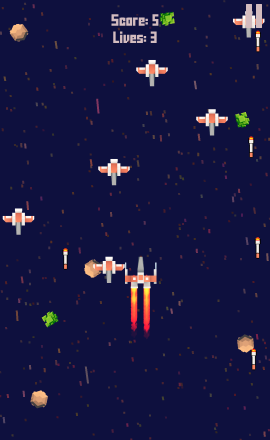
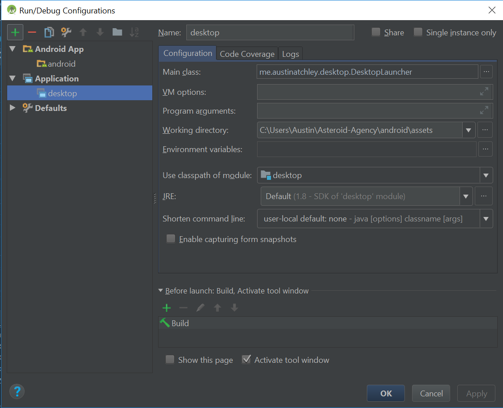

# Asteroid Agency

## About

Written in Java, using LibGDX as the base game framework, Scene2D for UI, and Box2D for physics. This project was created purely for the fun of writing a simple game, so I probably won't be able to work on it as much as I would like.

The name of the game is to smash as many asteroids as possible! This must be done while avoiding the green space junk and enemy fire.

## Build Instructions

Pull the project, and open in Android Studio.

### Android

Assuming you have setup Android Studio, the project runs on either the built-in emulator or your connected phone.

### Desktop

The game also runs on desktop platforms, but you will have to include the `android` directory in order to lead the assets stored there. In Android Studio, this can be done by creating a custom Run Configuration, as shown below:
 
 